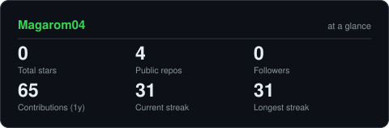
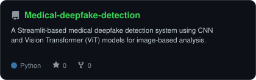
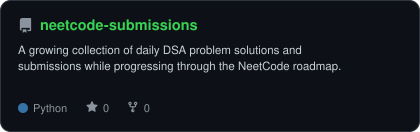

<div align="center">

<!-- PORTRAIT - generated by scripts/dotify.py -->

<!-- Your portrait will be generated in the next step. -->


<br>

<!-- NAME / TAGLINE - animated typing -->

<a href="https://github.com/Magarom04">
  
</a>

<br>

<!-- SOCIALS -->

<a href="https://www.linkedin.com/in/om-magar-5b187437">
  
</a>

<a href="https://leetcode.com/u/Om_M/">
  
</a>


</div>

---

## `~/` whoami

```console
$ cat about.txt
```

Hi, I'm **Om Magar**, a Computer Science & Engineering graduate interested in **Artificial Intelligence, Machine Learning, Computer Vision, and Software Development**.

* Currently building and exploring **AI/ML and Computer Vision systems**
* Solving **Data Structures & Algorithms** problems with a focus on problem solving
* Working with **Python, C++, PyTorch, OpenCV, and Scikit-learn**
* Interested in building practical AI systems that can be deployed and used in the real world

<br>

<div align="center">

## `~/` toolbox


</div>

---


<div align="center">


</div>

---

<div align="center">

## `~/` skill radar

<picture>
  <source media="(prefers-color-scheme: dark)" srcset="assets/radar-dark.svg">
  <source media="(prefers-color-scheme: light)" srcset="assets/radar-light.svg">
  
</picture>

</div>

---

<div align="center">

## `~/` contribution calendar

<!-- 3D isometric calendar, regenerated by .github/workflows/metrics.yml -->


<br><br>

<!-- Snake eats the contribution graph - .github/workflows/snake.yml -->

<picture>
  <source media="(prefers-color-scheme: dark)" srcset="https://raw.githubusercontent.com/Magarom04/Magarom04/output/snake-dark.svg">
  <source media="(prefers-color-scheme: light)" srcset="https://raw.githubusercontent.com/Magarom04/Magarom04/output/snake.svg">
  
</picture>

</div>

---

<div align="center">

## `~/` the numbers

<!-- Generated by scripts/cards.py into this repo -->

<picture>
  <source media="(prefers-color-scheme: dark)" srcset="assets/card-stats-dark.svg">
  <source media="(prefers-color-scheme: light)" srcset="assets/card-stats-light.svg">
  
</picture>

<br>


<br><br>


</div>

---

<div align="center">

## `~/` selected work

<!-- Cards generated by scripts/cards.py from assets/projects.json -->

<table>
<tr>

<td width="50%" align="center">

<a href="https://github.com/Magarom04/Medical-deepfake-detection">

<picture>
  <source media="(prefers-color-scheme: dark)" srcset="assets/card-Medical-deepfake-detection-dark.svg">
  <source media="(prefers-color-scheme: light)" srcset="assets/card-Medical-deepfake-detection-light.svg">
  
</picture>

</a>

</td>

<td width="50%" align="center">

<a href="https://github.com/Magarom04/neetcode-submissions">

<picture>
  <source media="(prefers-color-scheme: dark)" srcset="assets/card-neetcode-submissions-dark.svg">
  <source media="(prefers-color-scheme: light)" srcset="assets/card-neetcode-submissions-light.svg">
  
</picture>

</a>

</td>

</tr>
</table>

</div>

---